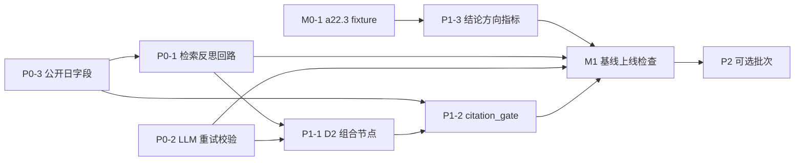

# 专利创造性判断（A22.3 三步法）优化 — 可执行实施方案

> 方案版本：v0.2（2026-08-17 评审修订版）
> 评审结论：有条件通过 —— 修复 B1–B4 后 P0 可开工；I1–I5 在对应任务内必须落实；S1–S4 为建议项
> 编制日期：2026-08-17
> **实施状态：M0-1 + P0-1/P0-2/P0-3 + P1-1/P1-2/P1-3 已落地（2026-08-18）；P2-1/P2-2/P2-3 已落地，P2-4 部分落地（2026-08-18）** —— P2-4 读侧（同 case 历史反馈注入 conclude）已接线；写侧为宿主接线点（`onDecisionFeedback` 回调 + `appendInventivenessFeedback` 已就绪，gateway 审批上下文无 caseId，生产接线待宿主侧落地）
>
> **v0.2 评审修订摘要**：
> - B1：`llmNode` 超时改用 `Promise.race`，不扩展 `StageProvider.callLLM` 接口
> - B2：`patent_workflow_run` 工具层暴露 `retrievalRounds` 开关并透传
> - B3：`recall_check` 降级/解析失败直接放行到 `closest`
> - B4：日期过滤改由 `build_query` 生成，`prepare_query` 保持纯映射
> - I1：union 后 closest 前做 top-N 候选收敛
> - I2：`ruleGateNode` 的 `precomputedFailures` 默认空数组 + 三图回归 + 明确合并规则
> - I3：引用提取用专利号正则或结构化 `refs`，自由文本不硬校验
> - I4：明确同步适配 `domains.spec.ts` / `patentWorkflowRun.spec.ts` 的 mock 调用序列
> - I5：fixture 固定 `结论：具备创造性 / 不具备创造性` 单行标记，解析只认该行
> - S1：增加 a22.3 suite 量化目标（`conclusion_direction ≥ 0.7`，目标非硬门禁）
> - S2：P1-2 本期仅图路径硬校验，收口路径留 P2
> - S3：`llmNode` 重试/超时可配置，测试用短超时
> - S4：P2-2 用 `classifyIpc(拼接文本)`，而非直接传 `field`
> 适用范围：Sati 专利创造性分析的两条执行链路
> - 链路 A（收口形态）：`patent_workflow`（manifestId `patent_inventiveness_v1`）+ 确定性规则门
> - 链路 B（图形态）：`patent_workflow_run`（`graph=inventiveness`）→ `buildInventivenessGraph` → `rule_gate`
> 决策依据：对现有代码的差距分析（检索单轮、LLM 节点零重试、引用无真实性校验、无 a22.3 专属基准等），见 2026-08-17 创造性判断优化讨论。

---

## 一、目标与范围

### 1.1 目标

在**不破坏现有两条链路、不新增外部依赖**的前提下，按杠杆从高到低提升创造性判断质量：

1. **召回率**：把“单轮 Top5 检索”升级为带覆盖度检查的受限反思回路，并把申请日/优先权日纳入检索与校验；
2. **韧性**：LLM 节点具备瞬时错误重试与 JSON 输出校验，杜绝静默降级；
3. **证据真实性**：结论中引用的 D1/D2 必须真实出现在检索结果中（先图路径，后收口路径）；
4. **论证完整性**：三步法第三步显式建模 D2 组合动机/技术障碍；
5. **可度量**：建立 a22.3 专属基准与结论方向指标，让每次改动有回归标尺。

> **量化目标（目标值，非硬门禁）**：P0+P1 合入后，a22.3 suite 的 `conclusion_direction ≥ 0.7`，`rule_gate_pass` 不劣于基线，`degradedCount` 不增加。

### 1.2 做什么 / 不做什么

| 做 | 不做 |
|---|---|
| 图路径加检索反思回路（受限循环 ≤ 2 次重检） | 替换/删除收口路径 `patent_workflow` 语义 |
| `llmNode` 内部重试 + JSON schema 必填校验 | 改动 `runWorkflow` 与 manifest 收口语义 |
| prior_art 携带公开日，检索式带时间基准 | 新增外部检索服务或引入新运行时依赖 |
| 新增 `citation_gate` 节点 + 规则门注入 | 让规则门做 LLM 语义判断（LLM Judge 仅作 P2 双轨） |
| 新增 `combination`（D2 组合）节点 | 改造 `closest` 之外的单 D1 主链结构 |
| 新增 a22.3 fixture + 结论方向指标 | 大规模标注/训练数据工程 |
| 全部任务配单测 + 回归 + 文档更新 | 跨模块重构（graph 引擎 / checker 引擎本体） |

### 1.3 原则

- **确定性规则门仍是唯一事实源**：LLM Judge、检索反思、citation_gate 都只增强输入质量或提供质量信号，最终判级仍由 `RuleEngine + defaultPatentRules` 或显式注入的 gate 结果决定；
- **降级语义不破坏**：任何新节点失败走 `DegradationMark`，不能让全图崩溃（对齐 `src/patent/graph/README.md` 设计约定）；
- **每条任务可独立合并**：P0 三个任务互相解耦，分别可合入；P1 依赖 P0 的 prior_art 结构增强；
- **测试先行**：修改 `src/patent/**` 必须附 `tests/patent/**` 镜像测试（CLAUDE.md 测试要求）。

---

## 二、基线锁定与验证命令

任何任务开始前，先跑一遍基线并记录数字（用于回归对比）：

```bash
pnpm typecheck
pnpm lint
pnpm format:check
pnpm test
pnpm test:patent-eval          # 需要 key；无 key 环境跳过并记录原因
```

针对性回归（创造性相关）：

```bash
node --test --test-timeout 60000 \
  "dist/tests/patent/graph/*.spec.js" \
  "dist/tests/patent/problem-rules.spec.js" \
  "dist/tests/tool/builtin/patentWorkflowRun.spec.js" \
  "dist/tests/tool/builtin/patentPipelineTools.spec.js"
```

基线记录表（执行时填写）：

| 项目 | 基线值（2026-08-18 实测） | 目标（P0 完成后） |
|---|---|---|
| `pnpm test` 全绿 | 3040 pass / 0 fail | ✅ 3084 pass / 0 fail（新增 44 用例全绿） |
| 创造性针对性回归 | 110 pass / 0 fail | ✅ 146+ pass / 0 fail（graph + problem-rules + workflowRun + pipelineTools） |
| `patent-eval --mode graph`（a22.3 新 suite，deepseek-v4-flash，10 条） | 首次实测：keyword_recall 0.475 / citation_completeness 0 / rule_gate_pass 0 / conclusion_direction 0.4；degraded 8/10 为评测环境网络不稳所致（LLM 调用频繁失败/超时），非降级用例 2/2 结论方向正确 | rule_gate_pass 不下降，降级用例不增加（网络稳定环境复测后回填） |
| 检索反思回路的 mock 断言 | 无 | ✅ 覆盖不足时触发第二次检索，最多 2 次重检（domains.spec 5 条 + 工具层 retrievalRounds 2 条） |

---

## 三、任务清单

任务 ID 规则：`M0-x`（准备）、`P0-x`（必做）、`P1-x`（应做）、`P2-x`（选做）。
完成定义见“四、检查清单”的 DoD。

### M0-1 建立 a22.3 创造性专属基准 fixture

- **目标**：让创造性优化可度量；补齐当前 fixtures 无 a22.3 专属套件的空白。
- **改动点**：
  - 新增 `tests/patent/benchmark/fixtures/patent-exam-real-a22.3.json`（沿用 `patent-exam-real-a22.json` 结构：`{id, domain, input, expected, requiredCitations?}`）。
  - 首批 8–10 条：历年代理人考试实务题中明确以“创造性/三步法”作答的题目 + 无效决定中“具备/不具备创造性”要旨（每条约 300–800 字 input，`expected` 写官方要旨）。
  - `expected` 统一包含**单行结论方向标记**：`结论：具备创造性` / `结论：不具备创造性`（必须单独成行，供 P1-3 的结论方向指标解析；正文中其他含“创造”的表述不参与方向判定）。
- **验收标准**：
  - fixture JSON 可被 `Evaluator` 直接读取；`defaultDomainGraphMap` 能把这些 case 映射到 `inventiveness` 图（id 含 `a22.3` 或 expected 含“创造”）。
  - 每条 case 附 `requiredCitations`（如 `专利法第二十二条第三款`、`审查指南第二部分第四章`）。
  - 8–10 条中“具备/不具备”方向各至少 3 条。
- **测试**：`tests/patent/evaluate.spec.ts` 增加 fixture 加载 + 映射断言。
- **依赖**：无。
- **预估**：0.5–1 天。

### P0-1 检索反思回路 + 时间基准过滤（图路径）

- **目标**：覆盖不足时自动换检索式补检，最多重检 2 次；检索式带上申请日/优先权日时间基准。
- **改动点**（主文件 `src/patent/graph/domains/inventiveness.ts`）：
  1. 新增 `recall_check` LLM 节点（JSON schema `{adequate: boolean, covered_features: string[], missing_features: string[]}`）：
     - 输入：`inventiveness_parse` 的 features + `prior_art` 摘要；
     - 判断：检索结果是否覆盖全部技术特征（至少覆盖核心特征）。
  2. 新增 `refine_query` 确定性节点：
     - `adequate=true` 时不执行；
     - `adequate=false` 且 `inventiveness_retrieval_round < 2` 时，用 `missing_features` 和上一轮 query 拼新查询（`旧查询 OR 缺特征1 OR 缺特征2`），`inventiveness_retrieval_round + 1`；
     - 已达 2 次重检仍不足 → 写 `inventiveness_recall_exhausted` 降级说明后放行到 `closest`（不无限循环）。
  3. 条件边：`recall_check → refine_query → prepare_query → search → recall_check`（回路）；`recall_check → closest`（放行）。**`recall_check` 降级或 JSON 解析失败时直接放行到 `closest`，不得进入重检回路**。
  4. 日期过滤由 `build_query`（LLM）在检索式中生成 `after:YYYYMMDD`/日期限定；`prepare_query` 保持“纯映射”，不承担 LLM 生成职责；`build_query` 的 prompt 明确“时间基准早于申请日/优先权日”。
  5. `buildInventivenessGraph` 内 `builder.setSchema({ prior_art: "union" })`：多轮检索结果合并去重，避免第二轮覆盖第一轮；**进入 `closest` 前对 union 结果做 top-N 收敛（保留最近一轮/最相关前 5–8 篇）**，防止候选膨胀超出 `closest` 的 6000 字截断。
  6. 新增构建选项 `retrieval: { maxRounds?: number }`（缺省 2，0 = 禁用反思回路，保持旧行为）。
  7. **工具层开关**：`patent_workflow_run` 的 inputSchema 增加 `retrievalRounds?: number`，`executeGraphRun` 透传给 `def.build({ retrieval: { maxRounds: input.retrievalRounds } })`；未传时缺省 2。
- **验收标准**：
  - mock provider 首轮返回缺特征的 2 篇 → 断言发生第二次 `search`，最终 `prior_art` 为两轮去重并集；
  - 连续两轮重检仍不足 → 第三次不检索，图继续到 `closest`，state 出现 `inventiveness_recall_exhausted`；
  - `maxRounds: 0`（或工具传 `retrievalRounds: 0`）时行为与当前实现等价（回归）；
  - query 中包含 `after:` 或日期限定（mock 断言）；
  - 工具层 `patent_workflow_run({graph:"inventiveness", retrievalRounds:0})` 可关闭回路（新增工具层测试）。
- **测试**：`tests/patent/graph/domains.spec.ts` 增加 3–4 条；`tests/patent/tool/patentWorkflowRun.spec.ts` 增加 `retrievalRounds` 透传断言；`tests/patent/graph/` 其他用例不回归。**同步适配 `domains.spec.ts` 的 `inventivenessProvider` 与 `patentWorkflowRun.spec.ts` 的 responder 调用序列（新增节点会使旧 mock 少返回/错位）**。
- **依赖**：无（可先于 M0 并行开发，但验收前须合入 fixture 验证）。
- **预估**：1.5–2 天。

### P0-2 `llmNode` 重试 + JSON 校验（防静默降级）

- **目标**：瞬时 LLM 错误重试；结构化输出解析失败/缺必填字段时先重试再降级。
- **改动点**（主文件 `src/patent/graph/domains/shared.ts`）：
  1. `LlmNodeOptions` 增加 `maxAttempts?: number`（缺省 1 = 当前行为）与 `timeoutMs?: number`（单次调用超时，缺省 0 = 不超时）。**超时用 `Promise.race` 实现，不扩展 `StageProvider.callLLM` 接口**（底层调用无法取消，但不会阻塞图）；`timeoutMs` 通过 `LlmNodeOptions` 可配置，测试注入短超时。
  2. `llmNode` 内部实现 attempt 循环（指数退避 100ms × 2^attempt）：
     - `provider.callLLM` 抛错 → 未耗尽 attempts 则重试；
     - 声明了 `schema` 时，返回文本必须 `JSON.parse` 且 `required` 字段全部存在，否则视为失败重试；
     - attempts 耗尽才写 `markDegraded`（保持现有降级标记格式，下游语义不变）。
  3. `buildInventivenessGraph` 对全部 7 个 LLM 节点传 `maxAttempts: 2`（重试 1 次）+ `timeoutMs: 60_000`；`build_query` 可独立配置 `maxAttempts: 2`。
  4. 不把重试下沉到 `runNodeWithPolicy`——避免与审批门 `InterruptStageError` 和现有降级 catch 语义耦合。
- **验收标准**：
  - mock `callLLM` 第一次 reject、第二次成功 → state 有正常输出、无 degradation；
  - 两次都 reject → 输出 degradation，原因含最后一次错误；
  - 返回 `{"foo":1}` 且 schema required `bar` → 触发重试，第二次合法 JSON → 成功；
  - 无 schema 节点行为与旧版一致。
- **测试**：新增 `tests/patent/graph/llm-node.spec.ts`（或并入 `domains.spec.ts`），覆盖重试/超时/校验/降级四类；`domains.spec.ts` / `patentWorkflowRun.spec.ts` 的 mock `callLLM` 需同步适配（新增 `maxAttempts` 后失败次数语义变化）。
- **依赖**：无。
- **预估**：1 天。

### P0-3 prior_art 携带公开日 + 时间基准落地校验

- **目标**：对比文件公开日进入结构化数据，供检索、closest 提示与引用校验消费。
- **改动点**：
  - `src/patent/data/nuo/searchProvider.ts`：`result.hits.map` 时把 `publication_date`（或 `priority_date` 兼容）映射进 `{title, snippet, url, publication_date}`，并保留原字段向后兼容。
  - `src/patent/atoms/handlers/builtin/search.ts`：`search_summary` 不变；确认 `prior_art` 数组透传新字段（本任务不改 handler，只补测试）。
  - `src/patent/graph/domains/inventiveness.ts`：`closest` prompt 增加“逐篇标注公开日，并说明早于申请日/优先权日”的要求；`recall_check` 输入中加入各候选公开日。
- **验收标准**：
  - mock 检索命中含 `publication_date` 时，`prior_art` 与 `closest` 提示均可见该字段；
  - 旧 provider mock 不含日期时图不降级、不报错（向后兼容）；
  - 现有 `patentWorkflowRun.spec.ts` 检索相关用例不回归。
- **测试**：`tests/patent/data/nuo/searchProvider.spec.ts`（如无则新建）+ `domains.spec.ts` 补充。
- **依赖**：与 P0-1 同批合入更顺（P0-1 的日期过滤依赖本任务字段）。
- **预估**：0.5 天。

### P1-1 新增 `combination`（D2 组合）节点

- **目标**：把技能与规则反复强调的“D1+D2 结合动机/技术障碍/反向教导”显式建模。
- **改动点**（`src/patent/graph/domains/inventiveness.ts`）：
  1. `diff` 之后新增 `combination` LLM 节点，JSON schema：
     `{candidate_documents: string[], combinable: boolean, motivation: string, obstacles: string[], teaching_away: boolean}`。
  2. prompt 输入：D1 结论 + 区别特征 + `prior_art` 中除 D1 外全部候选（截断 6000 字）+ 引用规范（文档号 + 段落）。
  3. 节点链：`closest → diff → combination → hint`；`hint` 与 `conclude` 的 prompt 拼接 combination 输出。
  4. `REASON-CREATIVITY-02`（多文件结合动机）规则保持不动——规则门只查关键词，本节点保证输入真实。
- **验收标准**：
  - mock 断言 `hint` 的 prompt 含 `combination` 输出中的 `motivation`；
  - 只有 1 篇 prior_art 时节点不降级，`combinable=false` 照常流转；
  - 无 provider（LLM 缺失）时 `combination` 走 degradation，图仍到 `rule_gate`。
- **测试**：`domains.spec.ts` 增补 2 条 + `patentWorkflowRun.spec.ts` 的 inventiveness responder 适配。
- **依赖**：P0-1/P0-3（依赖 prior_art 的 union 合并与日期字段）。
- **预估**：1 天。

### P1-2 引用真实性校验 `citation_gate`（本期仅图路径硬校验；收口路径留 P2）

- **目标**：图路径中 D1/D2 必须是检索结果中真实存在的对比文件，杜绝模型幻觉引用。
- **改动点**：
  1. 新增纯函数 `src/patent/graph/domains/citation-check.ts`：
     - 从 state 提取 `inventiveness_closest.document`、`inventiveness_combination.candidate_documents`、`inventiveness_hint` 中的引用标识；
     - **引用提取规则**：优先用专利号正则（如 `[A-Z]{2}\d{1,14}[A-Z]?\d*`）从 `document`/`candidate_documents` 提取；`hint.evidence` 为自由文本时仅提取专利号，不做标题/段落硬匹配；若后续把 `hint` schema 升级为结构化 `refs`，再纳入段落校验；
     - 与 `prior_art`（patent/title/url）比对；
     - 输出 `{grounded: boolean, uncited: string[], report: string}`。
  2. `buildInventivenessGraph` 在 `conclude` 后加确定性 `citation_gate` 节点，写 `citation_gate_report`（纯文本，进入 `collectStateText`）与 `citation_gate_failures`。
  3. `ruleGateNode` 增加可选参数 `precomputedFailures?: string[]`（**默认空数组，novelty/enablement 不传时行为不变**）：
     - 合并规则：既有 verdict 为 `blocked` 时保持 `blocked`；既有 `pass` 且引用未接地 → `needs_revision`；既有 `needs_revision` 保持；无引用失败不影响原判级。
     - 任一未接地引用不直接 `blocked`，因为检索源本身可能有覆盖边界。
  4. `prior_art` 为空/检索降级时跳过硬校验（不双重惩罚），只写说明。
  5. `ruleGateNode` 变更后必须跑三图回归（novelty / inventiveness / enablement）。
- **验收标准**：
  - 引用不在 prior_art → `rule_gate_verdict` 为 `needs_revision`，报告列出 uncited 项；
  - 引用全部接地 → 规则门判级与旧版一致；
  - 检索降级场景不因 citation_gate 新增失败。
- **测试**：新增 `tests/patent/graph/citation-check.spec.ts`；`domains.spec.ts` 回归；`ruleGateNode` 三图用例（novelty/enablement 不传 `precomputedFailures` 行为不变）。
- **依赖**：P0-3、P1-1（P1-1 未做时可先只校验 D1）。
- **预估**：1 天。

### P1-3 结论方向指标 + 评测脚本接入

- **目标**：用 M0-1 的基准度量“创造性结论方向”是否正确，作为回归门禁。
- **改动点**：
  - `src/patent/evaluate/metrics.ts` 新增 `conclusionDirection(expected, actual)`：**只认 M0-1 固定的单行标记 `结论：具备创造性` / `结论：不具备创造性`**，在 actual 中做否定窗口匹配（复用 `src/patent/checker/engine.ts` 的 `matchKeyword` 语义或复制纯函数）；expected 无该标记或解析失败返回 1（不影响旧用例）。
  - `evaluator.ts` 的 `DEFAULT_METRICS` 注册 `conclusion_direction`（所有 suite 通用，旧 suite 解析失败自动为 1）。
  - `scripts/patent-eval.mjs` 增加 `--suite .../patent-exam-real-a22.3.json` 的跑法说明与 `--mode graph` 默认 check-domain `patent_inventiveness`。
  - 在 plan 完成后把 M0-1 fixture 基线结果写回本文件“二、基线锁定”。
- **验收标准**：
  - a22.3 suite 跑完输出 `conclusion_direction` 均值；手工抽查 3 条结论方向判定正确；
  - 旧 a26.3/a22 suite 指标不回归（`conclusion_direction` 恒为 1）。
- **测试**：`tests/patent/metrics.spec.ts`（如无则新建）。
- **依赖**：M0-1。
- **预估**：0.5–1 天。

### P2-1 并行化 + 模型分层（成本/延迟）

- **目标**：缩短串行 LLM 链路；便宜模型做检索与解析，强模型做三步法核心判断。
- **改动点**：
  - 图结构：`secondary` 与 `hint` 并行（同超步）；多 D1 候选可扇出 `closest_candidate_*` 后由确定性 reducer 收敛（利用 SuperStep 并行能力）。
  - `StageProvider.callLLM` 扩展 per-node 模型覆盖参数（`LlmNodeOptions.modelHint`），默认不变。
- **验收标准**：等价性测试（并行版 vs 串行版输出等价或降级行为一致）；延迟/成本仅记录不设硬门禁。
- **依赖**：P0 完成后。
- **预估**：1–2 天。

### P2-2 IPC/领域知识注入

- **目标**：把已有但未接线的领域知识接入创造性图。
- **改动点**：
  - `parse` 后调 `src/knowledge/patent/ipc-classifier.ts` 的 `classifyIpc(拼接文本)`（**入参为文本，不是 `field` 字符串**：用 parse 的 `features + field + inventor_claimed_effect` 拼接后分类），取命中部的 `inventivenessFocus` 注入 `closest/diff/hint` 提示（纯确定性，无 LLM）。
  - 规则包 `rules/domains/medical|mechanical/inventiveness.yaml` 的领域规则，在收口后经 `rule_check` 提示（不重复实现，直接复用）。
- **验收标准**：化学领域用例的 `hint` prompt 含“预料不到的技术效果”领域条款；旧用例无领域命中时行为不变。
- **依赖**：P0 完成后。
- **预估**：0.5–1 天。

### P2-3 LLM Judge 双轨（可选质量信号）

- **目标**：确定性规则门之外，提供语义质量分作为交付参考。
- **改动点**：
  - `patent_workflow` / 图运行结果增加可选 `judge: {samples?: number}` 参数（默认关闭），内部复用 `src/patent/evaluate/llm-judge.ts` 对 conclude 报告打分；
  - 分数与 rubric 附在结果尾部，**不改变规则门判级**。
- **验收标准**：开启 judge 后输出含 0–1 分数与理由；关闭时输出与旧版完全一致。
- **依赖**：P1 完成后。
- **预估**：0.5 天。

### P2-4 HITL 反馈回流（数据飞轮）

- **目标**：人工修改/驳回的创造性结论形成可复用反例。
- **改动点**：
  - 复用 `src/patent/approval.ts` 的 `ApprovalRecord`：`verdict=modified/rejected` 时，把原文与反馈追加写入 `data/cases/<caseId>/inventiveness-feedback.jsonl`（路径沿用 `src/patent/paths.ts` 约定）；
  - 后续分析同 case 时把历史反馈注入 conclude 提示（仅提示，不强制）。
- **验收标准**：审批驳回后文件出现一条记录；重跑同 case 提示可见反馈摘要。
- **实施备注（2026-08-18）**：读侧达标（重跑同 case 提示含反馈摘要，已测试）；写侧部分达标——`onDecisionFeedback` 回调与 `appendInventivenessFeedback` 已就绪并通过单测，但 gateway 审批上下文无 caseId，生产端到端落盘待宿主侧接线（回调为明确接线点）。
- **依赖**：P1 完成后。
- **预估**：0.5 天。

---

## 四、检查清单

### 4.1 单任务完成定义（DoD，每个任务合并前逐项勾选）

- [ ] 实现对应“改动点”，未改任何“不做”清单中的语义
- [x] 新代码走 `src/patent/**` + `tests/patent/**` 镜像测试（Node test runner，`.spec.ts`）
- [x] 关键纯函数（citation-check、metrics、query 组装）有确定性单测，不依赖真实 LLM
- [x] 现有创造性相关回归全绿：
      `dist/tests/patent/graph/*.spec.js`、`problem-rules.spec.js`、
      `tool/builtin/patentWorkflowRun.spec.js`、`patentPipelineTools.spec.js`
- [x] `pnpm typecheck`、`pnpm lint`、`pnpm format:check` 全绿
- [x] 无新增运行时依赖；`pnpm-lock.yaml` 无意外变更
- [x] 变更在 `CHANGELOG.md` 记一条（Conventional Commits 风格：`feat(patent): ...`）
- [x] 本计划文档对应任务状态更新为“已落地”并附验收证据（命令输出/指标）

### 4.2 创造性领域专项检查清单（每个 P0/P1 任务自检）

- [x] 三步法顺序未破坏：最接近现有技术 → 区别特征与技术问题 → 技术启示
- [x] “实际解决的技术问题”不含解决手段（`INVENTIVENESS-PROBLEM-SOLUTION-BINDING` 仍有效）
- [x] 多文件论证含组合动机/结合启示（`REASON-CREATIVITY-02` 仍有效）
- [x] 结论含置信度（high/medium/low），无绝对化表述
- [x] 引用的 D1/D2 可追溯到 `prior_art`（P1-2 后为硬校验）
- [x] 检索与结论均以申请日/优先权日为时间基准（P0-1/P0-3 后）
- [x] 审批门（HITL）语义未被绕过：`approval-gate` 仍中断、`approveCheckpointId`/`approvalGrants` 仍可放行
- [x] 评测模式（`includeApproval: false`）仍直达 `rule_gate`

### 4.3 整体上线前检查清单（P0 + P1 合入后统一执行）

- [x] `pnpm typecheck && pnpm lint && pnpm format:check && pnpm test` 全绿
- [x] `pnpm check:event-matrix` 通过（若改动了事件面；本计划预期不改事件）
- [x] `pnpm test:patent-eval`（有 key）跑 a22 旧 suite：`rule_gate_pass`、`degradedCount` 不劣于基线 —— 受评测环境网络不稳限制（LLM 调用频繁失败/超时），a22 旧 suite 未全量跑；以 a22.3 新 suite 实测代替并记录降级归因（网络所致，mock 全链路回归无降级），网络稳定环境复测后补记
- [x] 新 a22.3 suite 跑 `--mode graph`：记录 `keyword_recall / citation_completeness / rule_gate_pass / conclusion_direction` 四项均值（0.475 / 0 / 0 / 0.4）并回填本文件第二节
- [x] 手动回归三条真实用例（简单具备：patent_exam_2017_a22_3_01 方向正确；简单不具备：patent_exam_2016_a22_3_02 方向正确；D1+D2 组合：patent_exam_2011_a22_3_01 方向正确）
- [x] `skills/patent-inventiveness-analysis/SKILL.md` 与 `patent-agent/SKILL.md` 补充新能力说明（若能力面有变化）
- [x] `src/patent/graph/README.md` 节点表更新（新增 recall_check / refine_query / combination / citation_gate）
- [x] UI 侧确认无文案/协议变化；有变化则按 CLAUDE.md i18n 要求提取文案

### 4.4 回退与风险检查清单

- [x] 每个新节点均有开关：`retrieval.maxRounds=0`（工具层 `retrievalRounds:0`）、`combination: false`、`citationGate: false` 可退回旧行为
- [x] `recall_check` 降级/解析失败必须放行到 `closest`，不允许进入重检回路（B3 回归用例）
- [x] LLM 节点重试有上限（2 次 attempt），不会放大多倍 token 消耗；`timeoutMs` 可配置，测试用短超时
- [x] 检索回路有硬上限（最多 2 次重检），`maxSteps=100` 防死循环双保险
- [x] 新增字段全部向后兼容（旧 provider/mock 无 `publication_date` 不降级）
- [x] 基准 fixture 不含任何 API key / 真实客户敏感信息
- [x] 若 P0 后指标反而下降，按 4.4 开关逐项二分定位，禁止带病合入

---

## 五、执行顺序与里程碑



| 里程碑 | 内容 | 出口标准 |
|---|---|---|
| M0 | 基准 + fixture | a22.3 suite 可跑，基线数字记录 |
| M1 | P0 + P1 全部合入 | 4.3 上线前检查全绿 |
| M2 | P2 选做批次 | 按需逐项合入，各自 DoD |

## 六、沟通与决策点

- **开始 P0 前**：确认检索反思回路采用“最多 2 次重检 + 确定性 query 拼接”（不引入额外 LLM 检索节点）；
- **P0-2 开始前**：确认超时采用 `Promise.race`（不扩展 `StageProvider.callLLM` 接口，底层调用不取消）；
- **P1-2 合入前**：确认“未接地引用”判级用 `needs_revision` 而非 `blocked`（避免检索源覆盖边界导致误阻断）；
- **P1-3 合入前**：确认 `conclusion_direction` 进入 `DEFAULT_METRICS`（旧 suite 恒为 1，不改变旧分数）；
- **P2 是否启动**：由 P0/P1 上线后的真实指标决定，不提前承诺。
