# Sati 技术债审计报告（复扫轮）

> **Mode**: Tech Debt Assessment（Brooks-Lint 六类腐化风险框架 × Pain×Spread 优先级）
> **日期**：2026-08-27 · 基线对比对象：2026-08-23 全仓审计（backlog §29）· 方法：广度自动化（measure-techdebt.mjs / madge / jscpd / 类型感知 SCC 分析）+ 定向人工深挖（前端 UI / 后端热点 / 架构依赖面三路）
> **性质**：只读审计，零源码改动。新条目已登记 `docs/technical-debt/backlog.md`；指标已刷新 `metrics.md`。本报告不取代账本——它解释这一轮**什么变了、什么该先动**。

## 结论速览

1. **总体向好**：裸 console 267→153、cli 计划基本清偿、类型断言两半已闭合、上轮 P0/P1 快修全部落地且带测试。
2. **一个旧结论被推翻**：`next-batches-schedule.md` §7 曾判定「模块级依赖环 0」；本次类型感知扫描发现 **3 组运行时值循环 SCC**（最大 16 文件横跨 agent↔tool↔patent↔workflow）。好消息：切割成本极低（3 处 import 行改写即可瓦解两个半环），已按最便宜切割顺序给出方案（TD-BOUND-003）。
3. **一个数据债实锤**：知识库 `wiki/复审无效/复审无效/` 整树重复——206 个 md / 2.1MB，其中 205 个逐字节相同，占全库卡片 ~13%（TD-KNOWLEDGE-N08）。
4. **一个债升级**：TD-AGENT-101 从「单 god function」改判为「恢复策略状态机在三个函数间复制」——单纯拆掉 `handleModelError` 会留下孪生体，须先抽策略方法。
5. **kanban 功能系列是本轮几乎所有增长增量的来源**：InProcessGateway +246、GatewayWsConnection 新 god method（dispatchRequest 316 行）、sati-bridge 四缓存填充前奏 ×4 复制、useBoardState 乐观变更协议 ×15 复制。方向上属可接受脚手架，但 TD-GATEWAY-002/006 预言的手工同步税已兑现。

## 指标基线 delta（2026-08-23 → 2026-08-27）

| 指标 | 前 | 后 | 判读 |
|---|---|---|---|
| 裸 `console.*` | 267 | **153** | 大幅改善；cli 191→137 且余量多为合法 CLI 输出，焦点移至 ui/server |
| 上帝函数 ≥300 行 | ~60 | **62** | +2：`useBoardState`(398)、`GatewayWsConnection.dispatchRequest`(316) |
| 静默吞错 catch | 151 | 155 | 微增，未恶化趋势 |
| InProcessGateway.ts | 1104 行 | **1350** | +246 全为 kanban 薄委托块，认知深度未变 |
| sati-bridge.js | 2055 | 2128 | kanban 溯源代码；N01 函数本体原封未动 |
| ComposerV2.tsx | 782 | **1061** | 无登记增长 +36%（新登记 N12） |
| useChatRealtimeHandlers.ts | 693 | **973** | 同上 +40%（新登记 N13） |
| 真实 any / @ts-ignore | ≈0 | ≈0 | 维持健康 |
| 分层违规 ui/server→src | 14 | 14 | 不变 |
| i18n 缺 key | teamPanel 2zh/1en | 同左 | 未修 |
| tests 文件数 | 465 | 490 | kanban 系列带了测试（board 2 个 spec） |

## Debt Summary（本轮发现 × 六类腐化风险）

| Risk | 本轮触及条目 | 平均 Pain×Spread | 分类 | 意图 |
|---|---|---|---|---|
| R2 变更传播 | GATEWAY-006（恶化实证）、AGENT-101 复核扩围、GATEWAY-002 待做半紧迫化 | 6.0 | Critical（临界） | accidental |
| R5 依赖无序 | **TD-BOUND-003（新，头条）**、fan-out 三点复核 | 6.0（但切割便宜） | Scheduled | accidental |
| R1 认知过载 | UI-CHAT-N11/12/13（新）、GOD-002 结构补充、GATEWAY-001 增长复核 | 4.5 | Scheduled | accidental |
| R3 知识重复 | KNOWLEDGE-N08 wiki 树（新）、UI-APP-N11/N12（新）、UI-CHAT-N14、bridge resolver×4 | 3.5 | Scheduled/Monitored | accidental |
| R4 偶然复杂度 | workflow barrel 导出零消费适配器、manifestToFlowGraph 双重未接线、四域单体趋势 | 4.0 | Scheduled | intentional→accidental |
| R6 领域模型扭曲 | browser-use 泄漏进 prepareSessionRuntime（轻）；src↔ui 类型镜像核实为健康（正例） | 2.0 | Monitored | intentional |

**Recommended focus**（与既有排期的衔接见文末）：① TD-BOUND-003 三刀快切 → ② AGENT-101 先抽策略方法再拆分 → ③ KNOWLEDGE-N08 删重复树 + 守卫 → ④ kanban 窗口期小卫生（UI-CHAT-N14 / QR hook / METHOD_GUARDS 表）。

---

## 头条一：运行时值循环依赖（TD-BOUND-003）

### Symptom
madge 在 src 报 59 条循环链；类型感知过滤后剩 **3 组真值环 SCC**（ui/src 经含 js/jsx 复核为 0 值环，仅 4 组 type-only）：

### Source（最小闭环边）

```mermaid
graph LR
    TI["tool/index.ts (:46)"]
    CBR["tool/registry/createBuiltinRegistry.ts (:41-71)"]
    PT["tool/builtin/patent{Eval,Workflow,WorkflowRun,FlexiblePlan,PlanTask,WorkerValidate,EvaluateEvidence}.ts"]
    PI["patent/index.ts (:77-80,:158)"]
    WD["patent/workflow-dag.ts (:15)"]
    WI["workflow/index.ts (:56-58)"]
    FAC["workflow/runtime/SubagentWorkflowAgentFactory.ts (:8)"]
    SAS["agent/sub/SubAgentSession.ts (:18)"]
    AL["agent/loop/AgentLoop.ts (:19 type-only)"]
    PTR["agent/loop/projectToolResults.ts (:2)"]
    TI -->|"value"| CBR -->|"value: 7 patent tools"| PT -->|"value: domain fns"| PI
    PI -->|"value"| WD
    WD -->|"VALUE FlowGraph · E2"| WI
    WI -->|"value factory · E3"| FAC
    FAC -->|"VALUE · E4"| SAS -->|"value AgentLoop"| AL
    AL -->|"type-only · E5a"| TI
    AL --> PTR
    PTR -->|"VALUE toCanonicalToolResultBlock · E1 真运行时闭环"| TI
```

- SCC-2（5 文件）：`domains/{inventiveness:16, enablement:11, novelty:12}` 从 `../index.js` 反向值引 `GraphBuilder`（实际定义于 `graph/engine.js`）。
- SCC-3（2 文件）：`TuiApp.tsx:6` 反向值引常量 `defaultTuiSessionKey`。

### Consequence
今日无初始化序 bug（ESM 容忍，值在使用时才解引用），但 patent/workflow 任一侧引入副作用初始化即成地雷；workflow barrel 把无生产消费方的 agent 适配器焊进公共面，反向拖住四个模块的编译面。

### Remedy（最便宜切割优先；前三刀合计 < 半天，均零行为变化）
| # | 切割 | 效果 | 工作量 |
|---|---|---|---|
| 1 | `defaultTuiSessionKey` 移入叶子模块 | 灭 SCC-3 | S |
| 2 | domains 三文件深引 `../engine.js`/`../types.js` | 灭 SCC-2 | S |
| 3 | `projectToolResults.ts:2`+`AgentLoop.ts:19`+`SubAgentSession.ts:25` 改深引 `tool/protocol/*.js` | 移除 SCC-1 唯一运行时闭环 | S |
| 4 | 删除 `workflow/index.ts:56-58` 的 SubagentWorkflowAgentFactory re-export（随 WORKFLOW-N01 决策同批） | E3 消失 | M |
| 5 | graph↔workflow 双轨归一（归属 PATENT-N01/WF-N01 排期，硬截止 2026-11-18） | 余下跨模块值边消失 | L |

附注：高扇出三点中 `adapters/index.ts`(66)/`createLocalGateway.ts`(49) 属合法编排层豁免；`createBuiltinRegistry.ts:3` 横向构造 gateway 域的 `KanbanBoardManager` 是方向性异味，建议随 tool-pack SPI 化收敛。

## 头条二：知识库整树重复（TD-KNOWLEDGE-N08）

- **Symptom**：jscpd Top 命中全部指向同一位置——wiki 卡片「复审无效」主题存在嵌套同名目录树。
- **Source**：`src/knowledge/patent/wiki/复审无效/复审无效/**`＝206 md / 2.11MB，205 个与外层同路径文件**逐字节相同**（diff -r 可复现）。
- **Consequence**：WikiCardLoader 冷启动扫描的 1548 卡里 ~13% 是噪声；card-index 若按内容入库则同源规则双份、向量行浪费、可能双引。
- **Remedy**：确认无消费方后删除嵌套树（git 可追回）；加一条 md 内容相同对阈值守卫防复发。工作量 S。

## 其余新登记（详见 backlog 对应条目）

| 条目 | 一句话 | 级别 |
|---|---|---|
| TD-UI-CHAT-N11 | processGrouping.ts 1295 行聊天管线杂物抽屉（26 函数混装六类职责） | P2 |
| TD-UI-CHAT-N12 | ComposerV2 782→1061 无登记增长 | P2 |
| TD-UI-CHAT-N13 | useChatRealtimeHandlers 693→973 无登记增长 | P2 |
| TD-UI-CHAT-N14 | kanban useBoardState：乐观变更协议复制 15 处 + 直连 i18n 单例 + 裸 `as` 载荷 | P2 |
| TD-UI-APP-N11 | IM 渠道 QR 登录轮询状态机 ×3 手写复制（含已知边界注释只同步到一份） | P2 |
| TD-UI-APP-N12 | SelectControl 与 Markdown 链接渲染器跨文件逐字复制 | P3 |

## 既有条目证据更新一览（不另开 id）

- **TD-GATEWAY-001**：+246 行=17 个 kanban 薄委托方法，benign；预授权第 5 域接入前做可选域 facade。
- **TD-GATEWAY-002**：`dispatchRequest :247-562` 具体化了畸形入参穿透路径；守卫表方案落地即同时满足穷尽性检查。
- **TD-GATEWAY-006**：手工同步税兑现（kanban 一族 ×4 文件）；判言被实证。
- **TD-UISERVER-N01/N02**：本体稳定；N02 行号漂移 + 填充前奏 ×4 复制并入 remedy。
- **TD-CONSOLE-001**：cli 余量 ~14/15 为合法用户输出，建议 mostly won't-fix（gatewaySetup 加 quiet flag 除外）；残留债转移至 `sati-bridge.js:713,731`。
- **TD-GOD-002**：createLocalGateway 三角色混合 + 双 reclaimCompleted 闭包 + browser-use 泄漏（jscpd 盲区的模式级重复）。
- **TD-ROUTER-003**：decide() 211→217 行，静态。
- **TD-PATENT-N01**：双轨导入面证据（E2 边 + manifestToFlowGraph 双重未接线）。
- **TD-TESTNSCRIPT-N07**：范围扩充 shared/{paths,sqlite,ttl-cache,debug} + telemetry/{sender,context}；board/task/methodology/adapters 核实已有直测。
- **健康面核实**：src↔ui 手镜像类型今日零漂移、kanban/patent/stores lint 逃逸为零——「DTO 镜像不标记」规则经核验成立。

## 与 next-batches-schedule.md 的衔接

- **勘误**：§7「R5 依赖混乱 · 模块级依赖环 0」作废（当时未做类型感知区分）；以 TD-BOUND-003 为准。割刀 1–3 可作为阶段一的随手项直接执行（纯 import 改写、typecheck 自验证、不触 inputSchema、不需浏览器验证）。
- **无需变更的排期判断**：① 类型断言（#163）仍为 ROI 最高单项；② #159 前端拆分清单建议吸收本轮 N11/N12/N13（新增两文件均已成上帝函数量级）；③ #150 多引擎统一与本轮 R5 根因同源——TD-BOUND-003 的割刀 4/5 应并入其决策而非独立排期。
- kanban 系列引入的四文件手工同步与方法守卫缺失（GATEWAY-002/006 合并 PR）建议插队为阶段一收尾项：机械、自验证、堵住一条对客户端不可诊断的错误路径。

## 复评边界

- 静态分析为主，未运行时实测；dispatchRequest 穿透路径与 wiki 双份入库影响为代码级推演，修复前建议各补一个最小复现用例（均已写入对应条目的建议字段）。
- 指标由 `node scripts/measure-techdebt.mjs --update docs/technical-debt/metrics.md` 生成，口径沿用 README（any 为正则上界，静默 catch ≠ 无参 catch 等）。
